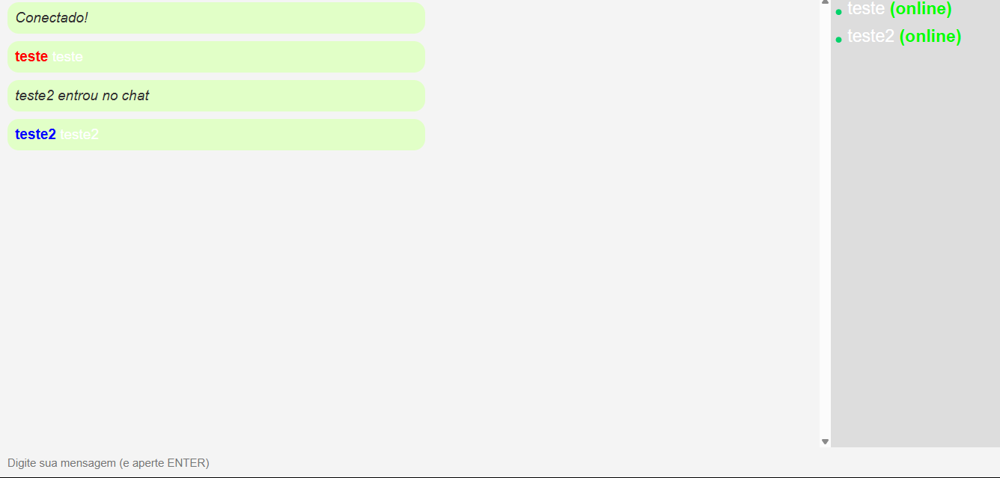

# 📢 Chat em Tempo Real

Projeto de chat em tempo real construído com Node.js, Express e Socket.io. Permite envio de mensagens instantâneas, exibição de usuários online e notificações de entrada/saída. Interface responsiva para desktop e mobile.

## 🚀 Tecnologias Utilizadas

- **Node.js** - Back-end
- **Express.js** - Servidor HTTPtem
- **Socket.io** - Comunicação em tempo real
- **HTML, CSS e JavaScript** - Interface do usuário

## 📸 Preview



## 🛠️ Instalação e Uso

1. **Clone o repositório**
   ```bash
   git clone https://github.com/seu-usuario/chat-socket.git
   cd chat-socket
   ```

2. **Instale as dependências**
   ```bash
   npm install
   ```

3. **Inicie o servidor**
   ```bash
   npm start
   ```

4. **Acesse o chat** no navegador
   ```
   http://localhost:3000
   ```

## 📌 Funcionalidades

✅ Envio e recebimento de mensagens em tempo real<br>
✅ Notificação de entrada/saída de usuários<br>
✅ Lista de usuários online<br>
✅ Interface responsiva<br>
✅ Mensagens diferenciadas para cada usuário


